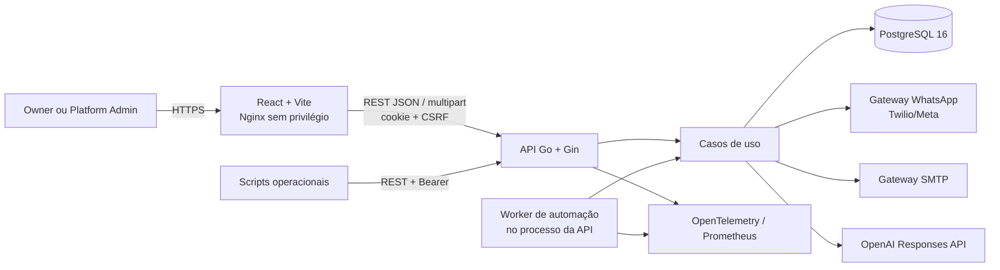
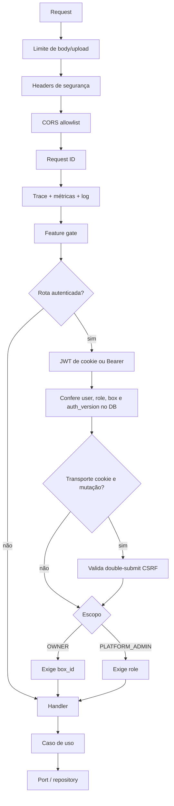
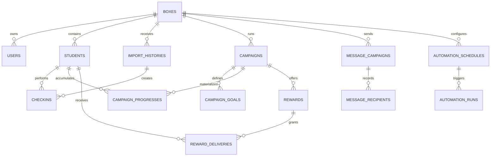
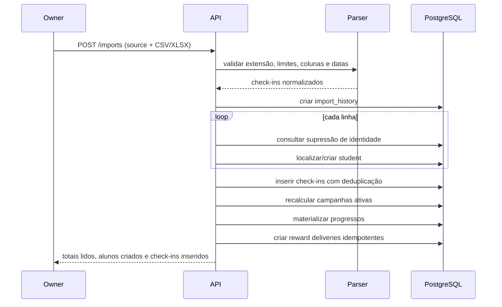
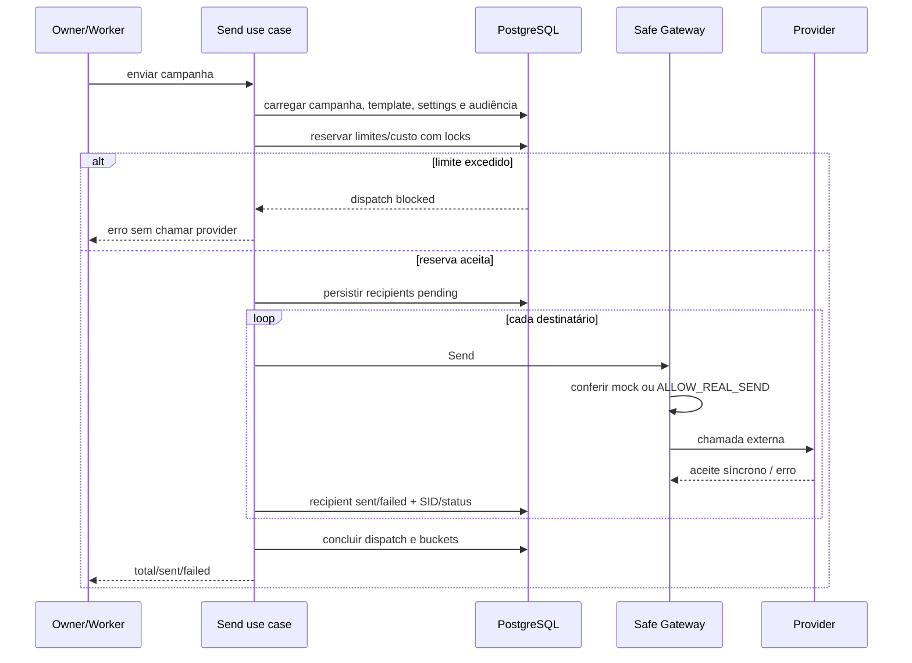

# EngageFit — manual de engenharia e design do sistema

Atualizado em: 2026-07-21

Status: documento canônico da arquitetura atual.

## 1. Finalidade deste documento

Este manual existe para que o dono técnico do EngageFit consiga:

- formar um modelo mental do produto e de sua arquitetura;
- localizar rapidamente a implementação de uma regra;
- entender invariantes, riscos e decisões que não são óbvios pela interface;
- operar e diagnosticar o sistema sem depender de quem o implementou;
- fazer mudanças sem quebrar isolamento, privacidade ou efeitos externos;
- distinguir comportamento implementado, decisão operacional e dívida conhecida.

Ele descreve o código nos repositórios `engage-fit-be` e `engage-fit-fe`. Quando houver divergência, o código e as migrations executadas são a fonte de verdade; o documento deve ser corrigido no mesmo pull request que mudar o comportamento.

Documentos especializados continuam válidos:

- segurança da sessão: [`session-security.md`](session-security.md);
- diagnóstico operacional: [`operations-runbook.md`](operations-runbook.md);
- privacidade e LGPD: [`privacy-runbook.md`](privacy-runbook.md);
- prontidão e operação local: [`application-readiness-guide.md`](application-readiness-guide.md);
- preparação de infraestrutura: [`railway-deployment-checklist.md`](railway-deployment-checklist.md);
- histórico cronológico: [`.ai/handoff.md`](../.ai/handoff.md).

### 1.1 Como usar este manual

Para formar o modelo mental, leia primeiro as seções 2 a 8 e depois acompanhe um fluxo completo nas seções 10, 11 e 13. Para operar o sistema, concentre-se nas seções 17 a 22. Antes de modificar comportamento, revise as seções 23 a 25 e localize a implementação pelo índice da seção 29.

Uma trilha prática, com exercícios executáveis localmente e critérios para saber se o conteúdo foi assimilado, está na seção 26.

## 2. O produto em uma frase

O EngageFit transforma check-ins exportados por Wellhub e TotalPass em acompanhamento de frequência, campanhas de engajamento, metas, entregas de brindes e públicos de comunicação para academias ou boxes.

O produto não é a fonte primária dos check-ins. Hoje ele ingere arquivos CSV/XLSX gerados por outras plataformas. Também não é um CRM genérico: campanha, meta, progresso e comunicação estão centrados na frequência do aluno.

## 3. Atores, tenancy e responsabilidades

### 3.1 Academia, ou `Box`

`Box` é o tenant. Quase todo dado de negócio pertence direta ou indiretamente a um `box_id`: alunos, check-ins, campanhas, configurações e comunicações.

Cada box configura:

- nome;
- dias sem treino que caracterizam risco de inatividade;
- cooldown entre mensagens de risco.

### 3.2 `OWNER`

É o usuário operacional de uma academia. O sistema atual espera conceitualmente um owner por box, embora o banco ainda não imponha uma constraint de unicidade para isso.

O owner:

- acessa somente o próprio `box_id`;
- importa check-ins;
- gerencia campanhas, metas e brindes;
- acompanha alunos, relatórios e entregas;
- registra preferências de contato e atende solicitações de privacidade;
- usa capacidades de comunicação e automação quando habilitadas;
- troca a própria senha.

### 3.3 `PLATFORM_ADMIN`

É o administrador do EngageFit, provisionado pelas variáveis `PLATFORM_ADMIN_*`. Seu usuário não possui `box_id`.

O platform admin:

- não entra nas rotas tenant do owner;
- lista academias e consumo de comunicação;
- altera políticas de limite e orçamento;
- administra conexão WhatsApp dedicada ou compartilhada;
- redefine a senha do owner com motivo obrigatório;
- gera registros em `admin_audit_logs` nas alterações sensíveis.

As credenciais definidas no ambiente são reconciliadas no startup. Alterar nome ou senha no ambiente atualiza o administrador persistido e invalida as sessões anteriores.

### 3.4 Academia como controladora e EngageFit como operador

A responsabilidade proposta, ainda sujeita a validação jurídica, é:

- academia: controladora, pois define finalidade, alunos e comunicações;
- EngageFit: operador, pois processa dados conforme a configuração da academia.

O código implementa mecanismos técnicos de opt-out, exportação, anonimização, retenção e auditoria. Ele não substitui contrato, base legal, política de privacidade ou processo organizacional de incidente.

## 4. Modelo mental da arquitetura



Decisões estruturais:

- frontend e backend são imagens e repositórios independentes;
- a API é stateless, exceto pelo rate limit em memória e pelo worker embutido;
- PostgreSQL é a fonte de verdade de estado e coordenação concorrente;
- não há broker, fila, Redis ou outbox;
- migrations, retenção e rotação de segredos são binários separados;
- integrações externas ficam atrás de interfaces e kill switches;
- o worker usa o mesmo conjunto de casos de uso da API.

## 5. Organização do código

### 5.1 Backend

O backend segue uma arquitetura em camadas próxima de ports and adapters:

| Área | Responsabilidade | Local |
|---|---|---|
| Domínio | Entidades, enums e regras locais sem HTTP/SQL | `internal/domain` |
| Aplicação | Casos de uso e orquestração de regras | `internal/app/<feature>` |
| Ports | Contratos de repositórios e serviços externos | `internal/ports` |
| HTTP | Router, middlewares, handlers e DTOs | `internal/adapters/http` |
| PostgreSQL | Models, mappers e implementação dos repositórios | `internal/adapters/persistence/postgres` |
| Gateways | Twilio, Meta, SMTP, OpenAI e relatórios | `internal/adapters/{whatsapp,email,llm,reports}` |
| Segurança | Hash de senha, JWT e cifra de segredos | `internal/adapters/security` |
| Observabilidade | Providers e métricas de negócio | `internal/observability` |
| Composition root | Montagem explícita das dependências e runtime | `cmd/api/main.go` |
| Operação | Migrate, rotate-secrets e retention | `cmd/*` |

Não há container de injeção de dependência. `cmd/api/main.go` instancia repositórios, gateways e casos de uso explicitamente. Esse arquivo é o melhor lugar para entender o grafo efetivo do runtime.

### 5.2 Frontend

O frontend é uma SPA React sem biblioteca de estado global ou roteador externo.

| Área | Responsabilidade | Local |
|---|---|---|
| Shell e roteamento | Sessão, capabilities e seleção por hash | `src/app/App.tsx` |
| Layout | Header, sidebar e menu por papel/capacidade | `src/components/layout` |
| Cliente HTTP | Cookie, CSRF, erros e downloads | `src/features/api` |
| Páginas | Estado e interação de cada feature | `src/pages` |
| UI básica | Botões, cards, inputs e estados | `src/components/ui`, `src/components/common` |
| Testes browser | Fluxo mockado e fluxo real | `tests` |

O roteamento usa `window.location.hash`. Não há code splitting nem cache de queries. Cada página carrega seus dados com hooks locais e chamadas do objeto `api` em `src/features/api/endpoints.ts`.

O frontend não armazena token. Todas as chamadas usam `credentials: include`; operações mutáveis leem o cookie CSRF e enviam `X-CSRF-Token`.

## 6. Pipeline de uma requisição HTTP



Ordem global em `internal/adapters/http/router.go`:

1. limite de body;
2. headers de segurança;
3. CORS;
4. geração/saneamento de `request_id`;
5. OpenTelemetry, quando habilitado;
6. métricas HTTP;
7. log estruturado;
8. recovery do Gin.

Erros HTTP usam o envelope:

```json
{
  "code": "stable_machine_code",
  "message": "mensagem segura",
  "request_id": "id-para-suporte"
}
```

O frontend transforma isso em `ApiError` e acrescenta `(suporte: <request_id>)`. SQL, erro bruto de gateway e detalhes internos não devem chegar à resposta.

## 7. Sessão, autenticação e autorização

### 7.1 JWT e transportes

O JWT é HS256 e contém:

- `sub`: user ID;
- `box_id`;
- `role`;
- `auth_version`;
- `iat` e `exp`.

O token expira em 24 horas no serviço JWT. O cookie possui max age configurável, portanto configurar `AUTH_SESSION_MAX_AGE_SECONDS` acima de 24 horas não estende a validade criptográfica do token.

Transportes aceitos:

- navegador: cookie HttpOnly;
- scripts: `Authorization: Bearer`.

Bearer tem precedência quando o header existe. CSRF é exigido apenas para cookie em `POST`, `PUT`, `PATCH` e `DELETE`.

### 7.2 Revogação por `auth_version`

Toda requisição autenticada relê o usuário no PostgreSQL e compara claims com o estado atual. Logout, troca de senha, reset administrativo e rotação da credencial do admin incrementam `auth_version`.

Consequência importante: logout encerra todas as sessões daquele usuário, não apenas o navegador atual. O mesmo vale para troca/reset de senha.

### 7.3 Cookies e CSRF

- sessão: `HttpOnly`, `Path=/`, `SameSite=Lax` por padrão;
- CSRF: legível pelo JavaScript, mesmo path/SameSite;
- ambos são `Secure` obrigatoriamente em production;
- CSRF usa 32 bytes aleatórios e comparação constante;
- logout limpa os dois cookies.

### 7.4 Isolamento de tenant

O isolamento é implementado na aplicação e nas queries, não por Row Level Security do PostgreSQL.

Padrão obrigatório:

- o middleware deriva `box_id` do usuário validado, nunca do body;
- casos de uso recebem `boxID` explícito;
- lookups e updates tenant devem filtrar pelo box ou validar o pai antes;
- relações sem `box_id` direto, como goals, rewards e recipients, são alcançadas por join/subquery até campaign/box;
- acesso cruzado deve parecer `404`, não revelar existência.

Ao criar um novo repositório, o teste de isolamento é parte da implementação, não uma melhoria opcional.

## 8. Capabilities e efeitos externos

Existem duas decisões diferentes:

1. a feature está disponível no produto?
2. a aplicação pode causar um efeito externo real?

| Capacidade | Disponibilidade | Permissão de efeito real |
|---|---|---|
| WhatsApp | `FEATURE_WHATSAPP_ENABLED` | `WHATSAPP_ALLOW_REAL_SEND` |
| E-mail | `FEATURE_EMAIL_ENABLED` | `EMAIL_ALLOW_REAL_SEND` |
| Automação | `FEATURE_AUTOMATION_ENABLED` + `AUTOMATION_WORKER_ENABLED` | depende também do canal chamado |
| Treino do dia | `FEATURE_WORKOUTS_ENABLED` | envio depende do WhatsApp |
| Geração por IA | `FEATURE_LLM_ENABLED` + workouts | `OPENAI_API_KEY` configurada |

Defaults:

- development: capabilities ligadas, efeitos reais desligados;
- production: capabilities desligadas, efeitos reais desligados;
- mocks continuam permitidos para testes sem rede externa.

O backend retorna somente booleans seguros em `GET /api/v1/capabilities`. O frontend esconde menus e redireciona hashes desabilitados, mas o bloqueio de segurança real é o middleware do backend.

Após a correção de 2026-07-21, gateways SMTP e WhatsApp reais exigem explicitamente `*_ALLOW_REAL_SEND=true` também em production. Habilitar apenas a página/feature não autoriza envio.

Dependências validadas no startup:

- worker exige feature automação;
- LLM exige workouts;
- permissão de envio WhatsApp/e-mail exige a feature correspondente.

## 9. Modelo de dados

### 9.1 Visão relacional principal



### 9.2 Grupos de tabelas

| Grupo | Tabelas | Papel |
|---|---|---|
| Tenancy/acesso | `boxes`, `users` | tenant, owner, platform admin e versão de autenticação |
| Ingestão | `students`, `import_histories`, `checkins` | identidade importada e frequência |
| Campanhas | `campaigns`, `campaign_goals`, `campaign_progresses` | período, meta por origem e snapshot de progresso |
| Brindes | `rewards`, `reward_deliveries` | catálogo e entrega por aluno elegível |
| WhatsApp | `whatsapp_settings`, `message_templates`, `message_campaigns`, `message_recipients` | configuração, catálogo oficial, disparos e auditoria de destinatários |
| E-mail | `email_settings`, `email_templates`, `email_campaigns`, `email_recipients` | configuração SMTP e campanhas |
| Automação | `automation_schedules`, `automation_runs` | agendas e execuções idempotentes |
| Treino/LLM | `workouts`, `workout_message_drafts`, `workout_message_recipients`, `llm_generation_logs` | treino, geração, aprovação e envio |
| Governança | `messaging_policies`, `messaging_usage_buckets`, `message_dispatches`, `admin_audit_logs` | limites, reservas, custo estimado e auditoria administrativa |
| Privacidade | `privacy_suppressions`, `privacy_audit_events` | impedir reimportação e auditar direitos do titular |
| Schema | `schema_migrations` | versão, checksum e tempo de execução |

### 9.3 Invariantes relevantes do banco

- UUID é usado como identificador em todas as entidades;
- campaign goal é único por `(campaign_id, source)`;
- campaign progress é único por `(campaign_id, student_id)`;
- reward delivery é única por `(reward_id, student_id)`;
- settings são únicos por box;
- template WhatsApp oficial é único por `(box_id, template_type)` quando o tipo não está vazio;
- execução de automação é única por `(box_id, execution_key)` quando a chave existe;
- provider SID é único nos recipients quando preenchido;
- supressão é única por `(box_id, source, external_id_hash)`;
- platform admin deve ter `box_id IS NULL`; owner deve ter box;
- deleções do box propagam para a maior parte dos dados tenant via cascade.

O schema não usa soft delete. Fechar campanha altera `active`; excluir campanha remove dependências conforme as foreign keys.

## 10. Fluxo de importação



### 10.1 Formatos e limites

- extensões: `.csv` e `.xlsx`;
- fontes: `wellhub` e `totalpass`;
- CSV detecta `,` ou `;`;
- XLSX lê strings compartilhadas e a primeira planilha;
- máximo de 50.000 linhas e 256 colunas;
- máximo de 50 MiB descomprimidos nas partes relevantes do XLSX;
- upload HTTP padrão máximo de 10 MiB, configurável.

O parser reconhece aliases portugueses e ingleses para nome, ID, e-mail, telefone, data e hora. Nome e data são os campos mínimos para uma linha útil.

### 10.2 Identidade do aluno

A chave lógica é escolhida nesta ordem:

1. external ID;
2. e-mail;
3. telefone;
4. nome.

Ela é normalizada com trim e lowercase, sempre dentro de `(box, source)`. A mesma pessoa em Wellhub e TotalPass é atualmente tratada como dois registros diferentes.

Antes de criar um aluno, o import consulta `privacy_suppressions`. Identidades anonimizadas são ignoradas e não reaparecem.

### 10.3 Deduplicação de check-in

A intenção de unicidade é `(box_id, source, student_id, checkin_date, checkin_time)` e o insert usa `ON CONFLICT DO NOTHING`.

Atenção: `checkin_time` pode ser nulo. No PostgreSQL, valores `NULL` não colidem em um unique index convencional, portanto reimportar visitas sem horário pode duplicá-las. Isso está listado como dívida conhecida.

### 10.4 Consistência da importação

A importação inteira não roda hoje em uma única transação. Histórico, novos alunos, check-ins e recálculo são passos sequenciais. Uma falha intermediária pode deixar efeitos parciais, embora reexecução e upserts reduzam parte do impacto.

## 11. Campanhas, metas, progresso e brindes

### 11.1 Campanha

Uma campanha define nome, descrição, início, fim e estado ativo. Datas são inclusivas nas queries de check-in.

### 11.2 Meta por origem

Cada campanha pode ter uma meta diferente para Wellhub e TotalPass. Um aluno só recebe progresso se existir goal para sua `source`.

### 11.3 Progresso materializado

`campaign_progresses` é um snapshot, não uma view calculada a cada leitura.

Um aluno só faz parte da campanha quando possui ao menos um check-in entre as datas inclusivas de início e fim e existe uma meta para sua origem. Alunos da academia sem presença no período não recebem um snapshot `0/meta`.

Para cada aluno abrangido:

```text
progress_percentage = current_checkins / target_checkins * 100
achieved             = current_checkins >= target_checkins
near_goal            = progress_percentage >= 80
```

Importações recalculam automaticamente todas as campanhas ativas. Também existe recálculo manual e por automação.

Cada recálculo substitui logicamente o conjunto de snapshots da campanha em uma transação: atualiza participantes ainda válidos e remove progressos de alunos que deixaram de ter check-in no período. Isso é necessário principalmente quando as datas da campanha mudam.

As entregas pendentes de brinde são sincronizadas com os alunos que continuam elegíveis. Pendências que perderam elegibilidade são removidas; entregas já realizadas permanecem como histórico operacional.

Consequências:

- mudar datas ou metas não recalcula o snapshot automaticamente;
- relatórios e públicos dependem do último recálculo;
- `near_goal` inclui alunos que já atingiram a meta, pois não exclui `achieved`;
- o público especial `almost_there` é mais estrito e exclui quem atingiu.

### 11.4 Regra `almost_there`

O aluno precisa satisfazer simultaneamente:

- ainda não atingiu a meta;
- progresso de pelo menos 80%;
- faltam entre 1 e 3 check-ins;
- a quantidade restante cabe nos dias restantes da campanha;
- campanha ainda não acabou.

### 11.5 Entregas de brinde

Após o recálculo, cada aluno `achieved` recebe uma entrega pendente para cada reward da campanha. A constraint `(reward_id, student_id)` torna a criação idempotente.

Marcar entregue grava `delivered=true` e `delivered_at`.

Importante: `rewards.quantity` é hoje estoque informativo. A criação de deliveries não bloqueia quando a quantidade é excedida e não reserva estoque transacionalmente.

## 12. Dashboard, risco e relatórios

### 12.1 Dashboard

O resumo combina:

- total de alunos;
- check-ins do mês UTC atual;
- check-ins por plataforma;
- alunos únicos elegíveis e próximos da meta nas campanhas ativas;
- alunos em risco;
- brindes pendentes e entregues.

### 12.2 Risco de inatividade

Um aluno aparece em risco quando:

- não possui check-in; ou
- o último check-in é anterior ou igual a `hoje - risk_inactive_days`.

O dashboard não remove do indicador alunos `paused` ou `not_interested`. Esses estados afetam a elegibilidade para comunicação de risco, não o cálculo visual de inatividade.

Para WhatsApp de inatividade, também se aplicam:

- `paused` e `not_interested` são excluídos;
- opt-out e anonimizado são excluídos;
- `risk_message_cooldown_days` precisa ter transcorrido;
- envio aceito atualiza `risk_last_message_at`.

O fluxo de e-mail inativo exclui paused/not interested e opt-out, mas atualmente não aplica nem atualiza o cooldown de mensagem de risco.

### 12.3 Relatórios

- elegíveis: progressos `achieved`, campanha, aluno, meta e reward;
- brindes pendentes: deliveries não entregues;
- frequência mensal: contagem e primeira/última visita por aluno;
- consulta de check-ins por intervalo: contagem e primeira/última visita por aluno, com busca, plataforma, ordenação e paginação locais na tela `Check-ins`;
- exportação: CSV gerado no backend ou arquivo preparado pela interface, conforme a tela.

## 13. Comunicação e públicos

Públicos disponíveis:

| Público | Regra |
|---|---|
| `all` | todos os alunos contactáveis |
| `near_goal` | snapshot `near_goal=true`; pode incluir achieved |
| `almost_there` | regra dinâmica estrita descrita acima |
| `achieved` | snapshot `achieved=true` |
| `inactive` | sem frequência recente, sujeito às regras de risco do canal |

`CanContact()` exige que o aluno não esteja anonimizado e não esteja `opted_out`. O estado `unknown` ainda permite contato tecnicamente; a base legal dessa escolha precisa ser definida operacional/juridicamente.

### 13.1 WhatsApp oficial

O catálogo de mensagens proativas é fixo no código em `internal/domain/whatsapp_template_catalog.go`:

- `ALMOST_THERE`;
- `GOAL_REACHED`;
- `WE_MISS_YOU`.

O body oficial não é editável pela API. Por box, persiste-se apenas metadata como Content SID, status de aprovação e idioma. Templates customizados legados estão descontinuados.

Modos de conexão:

- `platform`: credenciais, sender e Content SIDs vêm de `WHATSAPP_PLATFORM_*`;
- `dedicated`: configuração e credencial pertencem ao box e ficam cifradas no banco.

Twilio usa Content SID e variáveis numeradas. Meta Cloud permanece como adapter, mas o fluxo proativo oficial com Content Template está implementado operacionalmente para Twilio.

### 13.2 Pipeline de um disparo WhatsApp



`sent` significa aceite síncrono do provedor. Não significa entrega ao aparelho. StatusCallback, reconciliação de entrega e custo real continuam fora do sistema.

O envio é sequencial e não usa outbox/retry. Uma queda no meio pode produzir lote parcial. A campanha recebe `sent_at` mesmo se todos os recipients falharem; automações com `allow_resend=false` podem então ignorá-la em execuções futuras.

### 13.3 Governança de WhatsApp

Antes do gateway, o sistema cria uma reserva transacional:

- sempre aplica policy do box;
- se conexão `platform`, aplica também policy global;
- bloqueia por flag administrativa, limite por disparo, diário/mensal ou orçamento;
- usa buckets diários/mensais no timezone da policy;
- `SELECT ... FOR UPDATE` serializa reservas concorrentes;
- reserved vira accepted/failed na conclusão;
- dispatch bloqueado também é persistido para auditoria.

Defaults criados sob demanda:

| Escopo | Diário | Mensal | Por disparo | Custo estimado/unidade |
|---|---:|---:|---:|---:|
| Box | 100 | 1.000 | 100 | 100.000 micros |
| Plataforma | 1.000 | 10.000 | 250 | 100.000 micros |

Os custos são estimativas internas na moeda configurada; não há conciliação com fatura real.

Hoje essa governança cobre campanhas WhatsApp e drafts de Treino do dia. Campanhas de e-mail não reservam esses limites.

### 13.4 E-mail

E-mail possui settings SMTP/mock, templates editáveis, campanhas, preview e recipients.

- provider/settings precisam estar habilitados;
- mock não abre rede;
- SMTP real exige `EMAIL_ALLOW_REAL_SEND=true`;
- fora de production, `EMAIL_DEV_RECIPIENT_EMAIL` pode redirecionar tudo;
- cada recipient persiste pending e depois sent/failed;
- não há fila, retry, MIME HTML ou governança de orçamento.

### 13.5 Treino do dia e LLM

Fluxo:

1. criar treino draft/published;
2. selecionar público/campanha/alunos;
3. gerar mensagem com OpenAI;
4. revisar e editar `approved_body`;
5. aprovar explicitamente;
6. enviar pelo WhatsApp, sujeito à governança e opt-out.

O prompt pede linguagem brasileira, até 750 caracteres, foco técnico e segurança, e proíbe orientação médica/dieta individual. A mensagem deve conter `{{first_name}}`, substituído no envio.

O log LLM guarda provider, model, resumo do prompt, status e erro — não o prompt completo. A chamada usa a Responses API e timeout configurável.

Quando `student_ids` é fornecido, recipients são congelados no draft. Sem IDs explícitos, o código calcula o total da audiência, mas atualmente não persiste os recipients; enviar esse draft depois resulta em “no workout recipients selected”. Esse é um limite conhecido da API atual.

## 14. Automações, concorrência e idempotência

Modos:

- `full_daily`: recalcula e envia campanhas compatíveis;
- `recalculate_only`;
- `send_almost_there`;
- `send_achieved`;
- `send_inactive`.

Cada schedule define horário `HH:MM`, timezone IANA, dias `0..6`, `allow_resend` e enabled.

### 14.1 Execução agendada

O worker roda no processo da API em um ticker configurável. Em cada tick:

1. marca runs antigos em `running` como failed/stale;
2. lista agendas habilitadas;
3. verifica dia, horário e catch-up window;
4. faz claim atômico do slot no PostgreSQL;
5. usa chave `schedule:<id>:<UTC slot>`;
6. executa recálculo/envios;
7. registra contagens e conclusão.

Várias réplicas podem executar o worker: o claim e o unique index garantem um vencedor por slot.

### 14.2 Semântica `at-most-once`

Se a instância cair depois de um efeito externo e antes de registrar a conclusão, o mesmo slot não é repetido automaticamente. O objetivo é evitar mensagem duplicada quando o resultado é incerto.

Isso troca disponibilidade por segurança: o operador precisa revisar runs stale antes de criar uma nova execução/chave.

### 14.3 Execução manual

O endpoint aceita `Idempotency-Key` com 1–128 caracteres seguros. O frontend gera UUID por clique. Repetir a mesma chave retorna o run existente.

O script `scripts/daily-automation.mjs` é outro caminho operacional e também usa chave determinística diária.

### 14.1 Billing, franquias e acesso financeiro

Billing é um contexto interno isolado por portas, não um segundo servidor. O
Asaas é fonte de verdade para o movimento financeiro e meio de pagamento; o
EngageFit é fonte de verdade para catálogo versionado, contrato, franquia de
mensagens e autorização da academia.

O fluxo administrativo é:

1. sincronizar `billing_customer` pelo `box_id`;
2. criar assinatura mensal com `Idempotency-Key`;
3. persistir a referência externa e aplicar os limites do plano à política de
   mensageria;
4. projetar cobranças a partir de webhooks autenticados;
5. reconciliar periodicamente todas as cobranças da assinatura.

`boxes.status` continua representando o ciclo administrativo. A projeção
`boxes.billing_access_blocked` é independente: pagamento nunca reativa uma
academia suspensa administrativamente. Bloqueio financeiro revoga sessões,
impede novo login e exclui a academia do worker de automação.

Planos em uso têm preço, franquias e tolerância imutáveis. Uma mudança comercial
exige nova versão do plano, preservando o contrato histórico. Eventos Asaas são
persistidos por `(provider, provider_event_id)`, duplicatas processadas são
ignoradas e eventos falhos podem ser reentregues. O comando
`engagefit-billing-reconcile` é o caminho de recuperação quando o webhook falha.
Falhas de chamadas ao Asaas preservam apenas o status, o código e a primeira
descrição normalizada/limitada; o evento estruturado
`billing_provider_request_failed` inclui o `request_id` para correlação sem
registrar payload bruto ou credenciais.

Detalhes operacionais e passagem sandbox/produção estão em
`docs/asaas-billing-runbook.md`.

## 15. Privacidade e retenção

### 15.1 Preferência de contato

Estados:

- `unknown`;
- `opted_in`;
- `opted_out`.

Toda alteração exige uma origem textual e gera auditoria.

### 15.2 Exportação

O JSON contém:

- cadastro;
- check-ins;
- progressos;
- histórico WhatsApp, e-mail e Treino;
- horário de exportação.

A exportação também gera `privacy_audit_events`.

### 15.3 Anonimização

É transacional e exige confirmação + motivo de 5–500 caracteres.

Ela:

- bloqueia o student row;
- grava hash SHA-256 da identidade em `privacy_suppressions`;
- substitui o nome por “Aluno anonimizado”;
- limpa e-mail, telefone e external ID original;
- pausa risco e marca opt-out;
- limpa destino e erro dos recipients históricos;
- preserva check-ins, progressos e métricas sem identidade direta;
- grava auditoria.

O hash não é reversível, mas identificadores de baixa entropia ainda podem ser testados por força bruta por quem possuir acesso ao banco. O controle de acesso ao PostgreSQL continua essencial.

### 15.4 Retenção

`engagefit-privacy-retention` é dry-run sem flags e só exclui com `--apply`.

Padrões:

| Categoria | Dias |
|---|---:|
| recipients de comunicação | 365 |
| logs LLM | 90 |
| runs de automação | 180 |
| importações/check-ins | 730 |
| auditoria de privacidade | 1.825 |

Supressões não expiram automaticamente. A deleção ocorre em transação. Import history possui cascade para check-ins.

## 16. Criptografia de segredos

Credenciais dedicadas do WhatsApp e senhas SMTP usam AES-256-GCM antes da persistência.

Envelope:

```text
enc:v1:<key_id>:<nonce+ciphertext em base64url>
```

Associated data vincula o ciphertext ao tipo de segredo, box e campo. Copiar um valor cifrado para outro tenant/campo falha autenticação.

`DATA_ENCRYPTION_KEYS` é um keyring de chaves base64 de 32 bytes; `DATA_ENCRYPTION_ACTIVE_KEY_ID` escolhe a chave de escrita. Leitura aceita chaves antigas presentes no keyring.

Rotação correta:

1. adicionar nova chave sem remover antigas;
2. torná-la ativa;
3. executar `engagefit-rotate-secrets`;
4. atualizar todas as instâncias;
5. verificar a rotação;
6. remover a chave antiga.

O comando usa uma transação. Fora de production, a ausência de keyring mantém plaintext para compatibilidade local e emite warning. Production recusa iniciar sem cifra.

## 17. Migrations e releases

As migrations SQL são embutidas no binário `engagefit-migrate`.

Garantias do migrator:

- nomes sequenciais `NNN_nome.sql`, sem lacunas ou duplicatas;
- SHA-256 salvo em `schema_migrations`;
- migration aplicada não pode ser alterada silenciosamente;
- uma transação por arquivo;
- advisory lock global contra duas releases simultâneas;
- banco não vazio sem histórico é recusado;
- baseline só é aceito conscientemente em banco não vazio.

Ordem de release:

1. backup/restore disponível;
2. build das imagens;
3. `engagefit-migrate up` em job separado;
4. iniciar API;
5. esperar readiness;
6. atualizar frontend;
7. smoke sem efeitos reais;
8. observar métricas/logs.

A API nunca executa migration no startup. `engagefit-rotate-secrets` e retention também são operações separadas.

## 18. Runtime, containers e shutdown

### 18.1 API

- Go 1.25 Alpine multi-stage;
- usuário final `engagefit` sem privilégios;
- CA certificates e tzdata;
- `PORT` é fallback de `HTTP_PORT`;
- healthcheck em `/health/live`;
- pool PostgreSQL configurável;
- ping de startup com timeout;
- timeouts de header/read/write/idle;
- `SIGINT` e `SIGTERM` iniciam shutdown gracioso;
- servidor para de aceitar requests, worker encerra e telemetry faz flush.

### 18.2 Frontend

- build Node 22;
- runtime `nginxinc/nginx-unprivileged` como UID 101;
- SPA fallback para `index.html`;
- assets com cache de um ano e HTML sem cache;
- healthcheck `/health`;
- security headers no Nginx;
- `VITE_API_BASE_URL` e nome do cookie CSRF são fixados no build.

## 19. Observabilidade e diagnóstico

### 19.1 Sinais

- logs JSON em stdout;
- traces HTTP, GORM e clientes HTTP externos;
- métricas HTTP, runtime Go e pool PostgreSQL;
- métricas de importação, automação e gateways;
- heartbeat `engagefit.application.info`;
- endpoint Prometheus opcional;
- build info em `/health/build`.

Labels usam enums/rotas normalizadas; IDs de box, aluno, campanha e request não devem virar labels.

### 19.2 Health

| Endpoint | Significado |
|---|---|
| `/health` | alias de liveness |
| `/health/live` | processo HTTP está vivo |
| `/health/ready` | PostgreSQL responde em até 2 segundos |
| `/health/build` | version, commit e build_time |
| `/metrics` | scrape, opcionalmente protegido por Bearer |

### 19.3 Request ID

Toda requisição recebe `request_id`, preservando um valor seguro fornecido pelo cliente ou gerando um novo. O mesmo ID aparece em header, erro e log.

Primeiro passo de suporte: pedir somente o código de suporte, nunca senha, token, planilha ou corpo completo da mensagem.

### 19.4 Stack local e alertas

`docker-compose.observability.yml` sobe Collector, Prometheus, Loki, Tempo e Grafana. Regras locais cobrem ausência de heartbeat, 5xx, readiness, automação, importação e gateways.

Infraestrutura externa e retenção longa de sinais ainda precisam ser configuradas no Railway/Grafana Cloud.

## 20. Configuração que o responsável deve dominar

A lista executável completa está em `.env.example`. Os grupos conceituais são:

| Grupo | Variáveis principais | Risco de erro |
|---|---|---|
| Ambiente/HTTP | `APP_ENV`, `HTTP_*`, `PORT`, `TRUSTED_PROXIES` | timeout, IP falso, upload excessivo |
| PostgreSQL | `DATABASE_URL`, `DB_*` | startup/readiness e esgotamento de conexão |
| Sessão | `JWT_SECRET`, `AUTH_COOKIE_*`, `CORS_ALLOWED_ORIGINS` | login quebrado, CSRF ou cookie inseguro |
| Administração/setup | `PLATFORM_ADMIN_*`, `OWNER_SETUP_*` | conta privilegiada ou onboarding exposto |
| Capabilities | `FEATURE_*` | superfície de produto disponível |
| WhatsApp | `WHATSAPP_PLATFORM_*`, `WHATSAPP_ALLOW_REAL_SEND`, allowlist dev | efeito externo e credenciais |
| E-mail | `EMAIL_ALLOW_REAL_SEND`, destinatário dev + settings no DB | efeito externo |
| Automação | `AUTOMATION_WORKER_*`, stale/catch-up | duplicidade, perda ou horário errado |
| OpenAI | `OPENAI_API_KEY`, model, timeout | custo e envio de conteúdo ao provedor |
| Observabilidade | `OTEL_*`, `PROMETHEUS_*`, build info | sinais ausentes ou endpoint exposto |
| Criptografia | `DATA_ENCRYPTION_*` | perda irreversível de credenciais |
| Retenção | `PRIVACY_RETENTION_*` | exclusão prematura ou retenção excessiva |

Production faz fail-fast para banco, JWT, cookie Secure, admin e cifra. Setup/Prometheus habilitados exigem tokens fortes.

## 21. Superfície da API

O contrato definitivo está em `internal/adapters/http/router.go`. Mapa resumido:

| Prefixo | Escopo | Responsabilidade |
|---|---|---|
| `/health*`, `/metrics` | público/controlado | runtime e observabilidade |
| `/api/v1/capabilities` | público | booleans de disponibilidade |
| `/api/v1/auth`, `/setup/owner` | público/autenticado | sessão e onboarding |
| `/api/v1/box`, `/students`, `/imports`, `/checkins` | OWNER | tenant, alunos, ingestão e frequência por intervalo |
| `/api/v1/campaigns`, `/rewards` | OWNER | campanha, meta, progresso e brinde |
| `/api/v1/message-*`, `/whatsapp` | OWNER + capability | comunicação WhatsApp |
| `/api/v1/email*` | OWNER + capability | e-mail |
| `/api/v1/workouts*` | OWNER + capability | treino/LLM/WhatsApp |
| `/api/v1/automation*` | OWNER + capability | schedules e runs |
| `/api/v1/reports*`, `/dashboard*` | OWNER | leitura operacional |
| `/api/v1/admin*` | PLATFORM_ADMIN | governança, settings e reset |

Ao adicionar endpoint:

1. definir DTO e validação;
2. manter regra no caso de uso, não no handler;
3. passar `boxID` do contexto;
4. mapear erros para código seguro;
5. decidir capability e papel;
6. testar autorização, tenant e erro;
7. atualizar cliente/types frontend e este documento.

## 22. Estratégia de testes

### 22.1 Backend

- unitários: domínio, casos de uso, middleware, segurança e migrator;
- repository integration: PostgreSQL real e isolamento;
- smoke: API real, cookie/Bearer/CSRF e fluxo completo;
- CI: `go test -race -count=1 ./...`, vet, formato, migrations e binários.

`TEST_DATABASE_URL` habilita integrações PostgreSQL; sem ela esses testes fazem skip.

### 22.2 Frontend

- TypeScript + build Vite;
- Playwright mockado: sessão, capabilities e request ID;
- Playwright real: API/PostgreSQL, owner e platform admin;
- gateways externos desligados no E2E.

### 22.3 Matriz de risco

| Risco | Proteção principal |
|---|---|
| vazamento entre academias | testes de tenant nos repositories/API |
| token antigo continuar válido | auth_version e testes de logout/senha |
| CSRF | teste cookie sem/com header |
| migration alterada | checksum e idempotência |
| duas réplicas executarem schedule | claim concorrente PostgreSQL |
| ultrapassar limite WhatsApp | reserva concorrente e testes de governance |
| reimportar aluno anonimizado | teste de privacy suppression |
| quebrar fluxo crítico | smoke + Playwright real |
| chamar provider sem intenção | gateway tests + flags explícitas |

Comandos mínimos antes de merge:

```bash
cd engage-fit-be
go test ./...
go vet ./...
git diff --check

cd ../engage-fit-fe
npm run build
npm run test:e2e -- tests/ui-security.spec.ts
git diff --check
```

Mudanças em banco, sessão ou fluxo crítico também devem rodar integração PostgreSQL, smoke e E2E real.

## 23. Como alterar o sistema com segurança

### 23.1 Nova entidade/tabela

1. criar nova migration; nunca editar migration aplicada;
2. atualizar model e mapper;
3. criar/estender port de repository;
4. implementar repository com escopo de tenant;
5. adicionar caso de uso;
6. conectar no composition root;
7. adicionar handler/DTO/router;
8. testar migration vazia/idempotente e tenant;
9. avaliar retenção, exportação e anonimização.

### 23.2 Nova regra de campanha

Verificar simultaneamente:

- cálculo em `campaign_progresses`;
- recálculo por import/manual/automação;
- dashboard e relatórios;
- audiência WhatsApp, e-mail e workout;
- deliveries de reward;
- templates/previews;
- testes com datas/timezones.

Hoje há lógica de audiência semelhante em três packages. Mudanças devem ser aplicadas em todos ou precedidas de uma extração para serviço compartilhado.

### 23.3 Novo gateway externo

1. contrato em `internal/ports/services`;
2. adapter sem regra de negócio;
3. timeout e tracing;
4. kill switch separado da capability;
5. mock seguro;
6. normalização de erro;
7. métrica com labels limitadas;
8. nenhum segredo/body em log;
9. decidir idempotência, retry e reconciliação;
10. adicionar retenção e exportação se persistir dados pessoais.

### 23.4 Nova página frontend

1. tipo em `PageKey`;
2. item de navegação/papel/capability;
3. render em `App.tsx`;
4. types e endpoint centralizados;
5. estados loading/empty/error;
6. teste de acesso por menu e hash direto;
7. verificar layout responsivo.

## 24. Decisões e trade-offs que não devem ser esquecidos

| Decisão | Benefício | Custo/limite |
|---|---|---|
| progresso materializado | leitura simples e relatórios rápidos | exige recálculo explícito |
| JWT + auth_version no DB | revogação imediata | consulta ao banco em cada request |
| cookie HttpOnly + CSRF | menor exposição a XSS/storage | coordenação de cookies/CORS |
| at-most-once em automação | evita duplicar efeito incerto | pode exigir recuperação manual |
| policies/buckets com lock | limita concorrência sem Redis | transações mais serializadas |
| catálogo WhatsApp fixo | consistência e aprovação oficial | menos liberdade de template |
| worker no processo da API | operação simples | acoplamento de recursos e deploy |
| rate limit em memória | zero infraestrutura extra | não é global entre réplicas |
| sem RLS | código/repositories mais simples | isolamento depende de disciplina/testes |
| preservar check-ins após anonimização | métricas históricas | dado comportamental continua armazenado anonimamente |
| frontend sem state/router libs | pequena superfície | mais código manual e menos cache |

## 25. Limites e dívidas conhecidas

### Prioridade alta antes de escalar

- rate limit compartilhado para múltiplas réplicas;
- backup/PITR e restore ensaiado;
- StatusCallback assinado e reconciliação de entrega/custo WhatsApp;
- revisar importação como transação ou job recuperável;
- tornar identidade do aluno única no banco e segura para imports concorrentes;
- corrigir deduplicação de check-in com horário nulo;
- implementar reserva real de estoque se `reward.quantity` precisar ser limite;
- centralizar a resolução de audiência hoje duplicada em WhatsApp/e-mail/workouts.

### Produto/qualidade

- recuperação de senha por token/e-mail;
- paginação e filtros server-side;
- histórico e conversão de brindes/mensagens;
- persistir audiência automática de workout quando não há `student_ids`;
- alinhar indicador visual de risco com estados paused/not interested, se essa for a regra desejada;
- decidir se `near_goal` deve excluir `achieved`;
- aplicar governança/cooldown também a e-mail, se fizer sentido comercial;
- regressão visual e teste em dispositivos reais.

### Operação

- Grafana Cloud e alertas externos;
- secret manager, política de rotação e break-glass;
- ambientes, domínio, TLS/HSTS e rollback no Railway;
- procedimento jurídico e organizacional de incidente;
- definir fonte automatizada de check-ins.

## 26. Trilha recomendada para dominar o sistema

### Etapa 1 — modelo de negócio

Leia as seções 2, 3, 10, 11, 12 e 13. Depois responda sem consultar:

- por que a meta depende da origem?
- quando um aluno recebe delivery de brinde?
- qual a diferença entre near_goal e almost_there?
- o que “sent” significa no WhatsApp?

### Etapa 2 — request e segurança

Leia as seções 6–8 e percorra no código:

1. `App.tsx` → `client.ts`;
2. `router.go` → middlewares;
3. handler de auth → login use case;
4. JWT service → user repository.

Exercício: explique por que roubar apenas o cookie CSRF não autentica e por que um JWT anterior ao logout deixa de funcionar.

### Etapa 3 — fluxo vertical completo

Siga uma importação:

1. `ImportsPage.tsx`;
2. `endpoints.ts`;
3. `imports_handler.go`;
4. `import_checkins_usecase.go`;
5. parser e repositories;
6. recálculo e reward delivery;
7. dashboard.

Exercício: adicione mentalmente uma nova origem `gympass_legacy` e liste todos os lugares que mudariam antes de tocar no código.

### Etapa 4 — efeitos externos

Siga `SendMessageCampaignUseCase` desde audiência até gateway. Depois percorra `MessagingGovernanceGormRepository.Reserve/Complete`.

Exercício: simule três falhas:

- limite diário excedido;
- provider aceita 8 e falha 2;
- processo morre depois do quinto envio.

Descreva o estado esperado de dispatch, buckets, recipients e campaign.

### Etapa 5 — operação

Execute localmente:

```bash
make up
make migrate-status
make backend-run
make privacy-retention-dry-run
make observability-up
```

Exercício: gere um erro controlado, copie o request ID e encontre o log/trace correspondente.

### Etapa 6 — mudança supervisionada

Escolha uma mudança pequena, por exemplo adicionar um campo descritivo não sensível a campaign. Faça migration, domínio, repository, DTO, frontend e testes seguindo a seção 23. O objetivo é praticar o caminho inteiro.

## 27. Perguntas de revisão do proprietário

Você domina o núcleo quando consegue explicar:

- onde o `box_id` nasce e onde ele precisa ser aplicado;
- por que progress é snapshot;
- como importação gera brinde;
- como opt-out impede envio inclusive de draft antigo;
- por que logout invalida todas as sessões;
- diferença entre capability e permissão de efeito real;
- como duas réplicas evitam executar o mesmo schedule;
- o que acontece se uma chamada externa retorna sucesso e o DB falha depois;
- quais segredos são cifrados e como rotacioná-los;
- diferença entre liveness e readiness;
- por que migration não roda no startup;
- quais mudanças exigem avaliação de privacidade e retenção.

## 28. Glossário

| Termo | Significado no EngageFit |
|---|---|
| Box | tenant/academia |
| Source | origem do check-in: Wellhub ou TotalPass |
| Goal | meta de check-ins de uma campanha para uma source |
| Progress | snapshot materializado por aluno/campanha |
| Reward | tipo/estoque informativo de brinde |
| Reward delivery | direito operacional de entregar um reward a um aluno |
| Audience | regra para selecionar alunos contactáveis |
| Recipient | tentativa persistida por destinatário/canal |
| Dispatch | reserva governada de um lote WhatsApp |
| Capability | disponibilidade de uma área do produto |
| Real-send permission | autorização adicional para chamar rede externa |
| Auth version | contador que revoga JWTs anteriores |
| Execution key | chave idempotente de run de automação |
| Claim | aquisição atômica de um slot de schedule |
| Stale run | execução presa cujo resultado precisa de revisão |
| Billing plan | versão imutável dos termos comerciais depois de contratada |
| Billing projection | estado local derivado dos eventos financeiros do Asaas |
| Connection platform | WhatsApp compartilhado do EngageFit |
| Connection dedicated | WhatsApp próprio da academia |
| Suppression | hash que impede recriar aluno anonimizado |
| Request ID | identificador seguro de correlação para suporte |

## 29. Índice rápido de fontes de verdade

| Assunto | Arquivo principal |
|---|---|
| Montagem/runtime | `cmd/api/main.go` |
| Configuração | `internal/config/config.go`, `.env.example` |
| Rotas e autorização | `internal/adapters/http/router.go` |
| Domínio | `internal/domain` |
| Importação | `internal/app/imports/import_checkins_usecase.go` |
| Campanhas/progresso | `internal/app/campaigns/campaign_usecases.go` |
| Frequência/check-ins | `internal/adapters/persistence/postgres/repositories/checkin_repository.go`, `engage-fit-fe/src/pages/checkins/CheckinsPage.tsx` |
| Risco/dashboard | `internal/app/dashboard/dashboard_usecases.go` |
| WhatsApp/audiência | `internal/app/messages/message_usecases.go` |
| Governança | `internal/adapters/persistence/postgres/repositories/messaging_governance_repository.go` |
| Automação | `internal/app/automation` |
| Billing/Asaas | `internal/app/billing`, `internal/adapters/billing`, `docs/asaas-billing-runbook.md` |
| Privacidade | `internal/app/students/privacy_usecases.go`, `privacy_repository.go` |
| Workout/LLM | `internal/app/workouts`, `internal/adapters/llm` |
| Sessão | `internal/adapters/http/middleware/session.go`, `auth_middleware.go` |
| Criptografia | `internal/adapters/security/secret_cipher.go` |
| Migrations | `migrations/migrator.go`, `migrations/*.sql` |
| Observabilidade | `internal/observability`, `observability/` |
| Frontend shell | `engage-fit-fe/src/app/App.tsx` |
| Cliente frontend | `engage-fit-fe/src/features/api` |
| CI | `.github/workflows/ci.yml` nos dois repositórios |

## 30. Regra de manutenção deste manual

Uma alteração deve atualizar este documento quando modificar:

- ator, responsabilidade ou regra de negócio;
- entidade, relacionamento ou invariant de dados;
- fluxo crítico ou efeito externo;
- autenticação, autorização, privacy ou tenancy;
- capability, configuração ou default production;
- semântica de concorrência/idempotência;
- operação, release, health ou observabilidade;
- limitação conhecida ou trade-off.

O melhor momento para atualizar o manual é no mesmo commit da implementação. Documentação separada no tempo tende a descrever intenção, não o sistema real.
